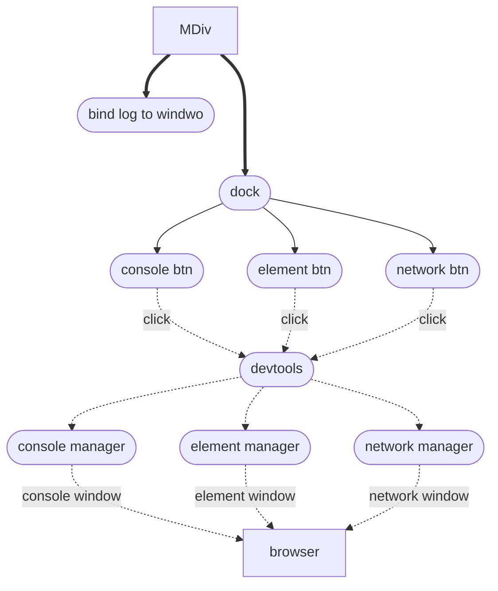
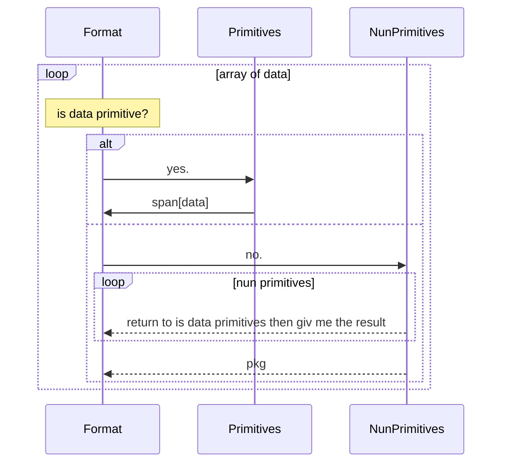

# MDEV
###### **MDev** is a devtools for wibsit 
---
## fetures
* console priview
* elements preview
---
## usage
* install it locally by run 
    ```js
      npm install MDiv
    ```
---
* using cdl link and past it in your html code as a javascript script
    ```html
      <script src="https://npm/MDiv"></script>
    ```

---
#App Structure

```txt
src
├── App.ts
├── dock
│   ├── apps
│   │   ├── console.ts
│   │   └── element.ts
│   └── main.ts
├── style
│   └── style.css
├── types
│   ├── dock
│   │   ├── apps
│   │   │   ├── console.d.ts
│   │   │   └── element.d.ts
│   │   └── main.d.ts
│   ├── global.d.ts
│   └── window
│       ├── console
│       │   ├── main.d.ts
│       │   └── src
│       │       └── main.d.ts
│       └── main.d.ts
└── window
    ├── console
    │   ├── formatters
    │   │   ├── main.ts
    │   │   ├── nunPrimitives
    │   │   │   ├── array.ts
    │   │   │   ├── handler
    │   │   │   │   └── separate.ts
    │   │   │   ├── main.ts
    │   │   │   └── object.ts
    │   │   ├── primitives
    │   │   │   ├── boolean.ts
    │   │   │   ├── main.ts
    │   │   │   ├── null.ts
    │   │   │   ├── number.ts
    │   │   │   ├── string.ts
    │   │   │   └── undefined.ts
    │   │   └── utils
    │   │       └── getType.ts
    │   ├── layout
    │   │   └── main.ts
    │   ├── log
    │   │   ├── bind.ts
    │   │   ├── logger.ts
    │   │   └── main.ts
    │   ├── main.ts
    │   └── utils
    │       └── getTime.ts
    ├── element
    │   ├── main.ts
    │   └── src
    │       └── main.ts
    ├── main.ts
    ├── screen
    │   ├── handler
    │   │   ├── closeHandler.ts
    │   │   ├── moveHandler.ts
    │   │   └── resizeHandler.ts
    │   └── main.ts
    └── utils
        ├── randomPosition.ts
        └── rectUtils.ts
```

# App Flow


# Console
```mermaidsequenceDiagram
participant Devtools
participant Console
participant Store
participant Format
participant Layout
participant LogMethods
Note over Devtools:+div(screen)
Devtools->>Console:giv me your content
Note over Console:+div(consoleContainer)
Console ->> Store:do you have any data

alt
Store->>Console:yes, take it
Console ->> Format:[data]
Note over Format:formating
Note over Format:+fragmentElement
Format ->> Console:fragmentElement
Console->>Layout:wrap this data
Note over Layout:+div*2(mainLayout,navbar)
Layout ->> Console:{main,navbar}
Console ->>Devtools:container

else

Store->>Console:no
Note over Console:i will create fake data
Console->>Layout:giv me a layout
Layout ->> Console:{main,toolbar}
Console ->>Devtools:container

end

Note over Devtools:add the container <br/>to the screen created <br/>then render on window

LogMethods->>Console:hey, add this.
Note over Console:i will save it in storage<br/>then added it if can
Console -->> Store: save this data
note over Console: am i activate
alt

Console->>Console:yes
Console ->> Format:[data]
Note over Format:formating
Format ->> Console:pkg
Note over Console:i will render it on screen

else

Console->>Console:no
Console ->>Console:ok, i will render when i can

end
```
> ## Format
